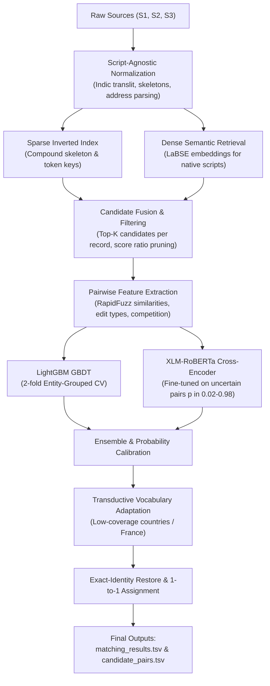

# 🏢 Amazon ML Challenge 2026: Multilingual Business Entity Resolution

[](https://www.python.org/)
[](https://lightgbm.readthedocs.io/)
[](https://huggingface.co/)
[](#-results--leaderboard-evolution)
[](LICENSE)

An end-to-end, high-performance machine learning pipeline for large-scale **Multilingual Business Entity Resolution**, developed for the **Amazon ML Challenge 2026**. 

The task requires linking millions of noisy, heterogeneous business listings (**Source-2** and **Source-3**) to canonical, deduplicated enterprise entities (**Source-1**) across multiple countries (**US, India, and an unseen test country: France**). Evaluated strictly under the **Macro $F_{0.5}$ score** (which heavily penalizes precision errors / false merges).

---

## 📌 Table of Contents

- [Problem Overview](#-problem-overview)
- [System Architecture](#-system-architecture)
- [Key Innovations & Technical Breakdown](#-key-innovations--technical-breakdown)
  - [1. Script-Agnostic Text Normalization](#1-script-agnostic-text-normalization)
  - [2. Dual Hybrid Blocking (Sparse + Dense)](#2-dual-hybrid-blocking-sparse--dense)
  - [3. Feature Engineering & Sibling Distractor Modeling](#3-feature-engineering--sibling-distractor-modeling)
  - [4. Stacked Model Hierarchy: LightGBM + Cross-Encoder](#4-stacked-model-hierarchy-lightgbm--cross-encoder)
  - [5. Transductive Adaptation & Decision Rule](#5-transductive-adaptation--decision-rule)
- [Repository Structure](#-repository-structure)
- [Environment & Hardware Requirements](#-environment--hardware-requirements)
- [Step-by-Step Reproduction Guide](#-step-by-step-reproduction-guide)
  - [Option A: Local / Cluster Execution](#option-a-local--cluster-execution)
  - [Option B: Kaggle GPU Notebook Runner](#option-b-kaggle-gpu-notebook-runner)
- [Submission Validation](#-submission-validation)
- [Results & Leaderboard Evolution](#-results--leaderboard-evolution)

---

## 🎯 Problem Overview

Given three datasets:
1. **Source 1 (`train_source1.tsv` / `test_source1.tsv`)**: Deduplicated canonical target business records containing `entity_id`, `business_name`, `business_address`, and `country`.
2. **Sources 2 & 3 (`train_source2.tsv`, `train_source3.tsv` / `test_source*.tsv`)**: Noisy query records originating from heterogeneous web crawls, directories, and registrations.
3. **Ground Truth (`train_ground_truth.tsv`)**: 1-to-many mapping from `source1_entity_id` to comma-separated `matched_entity_ids` (Source 2 and Source 3 items).

### Core Challenges:
- **Scale:** Tens of millions of potential pairwise comparisons ($O(N \times M)$ is intractable).
- **Multilingual & Cross-Script Records:** Names written in native Brahmic/Indic scripts (Hindi, Tamil, Telugu, Bengali, Gujarati, Punjabi, Marathi, Kannada, Malayalam) must match English/Latin Source-1 records.
- **"Sibling" Business Distractors:** Businesses sharing identical names on the same commercial street with adjacent house numbers (e.g., Suite 101 vs Suite 102, or 287 vs 2870). A naive classifier easily merges these into false positives.
- **Unseen Geographic Domain:** Training data contains US and India; the test set introduces unseen distributions (France) with distinct address and naming conventions.
- **Metric Constraint:** **Macro $F_{0.5}$** penalizes false positives twice as heavily as false negatives ($\beta = 0.5$). Every Source 2/3 query record can belong to **at most one** Source 1 entity.

---

## 🏗 System Architecture

The pipeline processes raw data through a 5-stage funnel:



---

## 🔬 Key Innovations & Technical Breakdown

### 1. Script-Agnostic Text Normalization
Implemented in [`normalize.py`](business_entity_resolution/src/normalize.py):
- **Unicode Indic Transliteration:** Custom rule engine covering 9 Brahmic scripts (Devanagari, Bengali, Gurmukhi, Gujarati, Oriya, Tamil, Telugu, Kannada, Malayalam) without external heavy NLP dependencies. It processes characters according to Unicode character metadata, handling inherent schwa vowels and consonant conjuncts.
- **Phonetic Consonant Skeletons:** Extracts vowel-stripped, consonant-normalized skeletons (`ph` $\to$ `f`, `w` $\to$ `v`, `c/q` $\to$ `k`, `z/g` $\to$ `j`). Skeletons allow resilient indexing across typos, OCR errors, and phonetic variations.
- **Entity Suffix & Alias Disentanglement:** Removes legal suffixes (`inc`, `llc`, `pvt ltd`, `sarl`, `sas`, `gmbh`) and splits multi-view aliases (`d/b/a`, `f/k/a`, `trading as`, website URLs).
- **Address Canonicalization:** Normalizes 40+ street types (avenue $\to$ `av`, boulevard $\to$ `bd`), ordinal numbers (`first` $\to$ `1st`), Indian administrative markers (`sec`, `col`, `ngr`), French street indicators (`rue`, `impasse`, `allée`), and US state abbreviations.

### 2. Dual Hybrid Blocking (Sparse + Dense)
Implemented in [`blocking.py`](business_entity_resolution/src/blocking.py), [`export_native.py`](business_entity_resolution/src/export_native.py), and [`emb_candidates.py`](business_entity_resolution/src/emb_candidates.py):
- **Reverse Top-$K$ Blocking:** Because each query record belongs to at most one Source-1 entity, blocking runs in reverse: indexing queries against Source-1 candidate lists.
- **Compound Blocking Keys:** Uses multi-field combinations to prevent index flooding:
  - `N:<name skeleton>` (full name skeleton)
  - `b:<skel_i>_<skel_j>` (name skeleton bigrams)
  - `i:<initials>` (acronyms)
  - `h:<number>_<word>` (house number $\times$ street word)
  - `x:<name skel>_<address word>` (cross-field interaction)
- **Dense Multilingual Retrieval (LaBSE):** For records with native Brahmic scripts, token overlap often misses true targets. We use frozen **LaBSE** (`sentence-transformers/LaBSE`, 471M params) to retrieve the top-100 cross-script nearest neighbours on GPU.
- **Address-Aware Re-Ranking:** LaBSE neighbours are re-ranked using:
  $$\text{Score} = \cos(\theta) + 0.5 \times \text{Jaccard}(A_{\text{nums}}) + 0.5 \times \text{Jaccard}(A_{\text{words}})$$
  The top 2 unindexed neighbours are merged as extra candidates, boosting native-script candidate recall from **88.9% to 95.6%**.

### 3. Feature Engineering & Sibling Distractor Modeling
Implemented in [`features.py`](business_entity_resolution/src/features.py) and [`sibling_prior.py`](business_entity_resolution/src/sibling_prior.py):
- **RapidFuzz String Metrics:** Levenshtein ratios, token set ratios, token sort ratios, partial ratios, and Jaro-Winkler similarities across full names, core names, skeletons, and addresses.
- **House-Number Taxonomy:** Distinguishes typographic mutations from distinct addresses:
  - Exact match vs. prefix/suffix extension (`101` vs `101A` vs `1010`).
  - Sibling business detection (`287` vs `2870`, `1001` vs `1002`).
- **Candidate Competition Features:** Models how a candidate fares relative to competing matches for the same query record (top score margin, gap between rank 1 and 2, total candidates per entity).
- **Learned Word-Difference Odds:** Empirical log-odds measuring whether differing tokens represent benign filler words or entity-distinguishing names.

### 4. Stacked Model Hierarchy: LightGBM + Cross-Encoder
Implemented in [`pipeline.py`](business_entity_resolution/src/pipeline.py), [`maximumoutput.py`](business_entity_resolution/src/maximumoutput.py), and [`cross_encoder.py`](business_entity_resolution/src/cross_encoder.py):
- **LightGBM Classifier:** Gradient boosted decision tree (127 leaves, 400 rounds) trained on 2-fold cross-validation grouped strictly by `source1_entity_id` to avoid data leakage.
- **Deep Cross-Encoder (`xlm-roberta-base`):** Fine-tuned on the subset of hard/uncertain pairs ($p \in [0.02, 0.98]$). Encodes `"<name> | <address>" [SEP] "<name> | <address>"` together to capture cross-attention nuances, achieving **0.985 AUC** on hard pairs.

### 5. Transductive Adaptation & Decision Rule
Implemented in [`restore_exact.py`](business_entity_resolution/src/restore_exact.py) and [`stage2.py`](business_entity_resolution/src/stage2.py):
- **Exclusive 1-to-1 Assignment:** Every query record is assigned to its highest-probability candidate if and only if $P(\text{match}) > \tau$, satisfying the competition rules.
- **Macro $F_{0.5}$ Threshold Optimization:** Global threshold and per-entity expected $F_{0.5}$ decision boundary tuned on out-of-fold predictions.
- **Transductive Vocabulary Adaptation for France:** The test set introduced France, where training word odds covered only 51% of vocabulary. We automatically detect low-coverage countries and self-train word statistics using ultra-confident test pseudo-labels ($p > 0.97$ and $p < 0.03$), expanding coverage to 96%.
- **Exact-Identity Restore:** Protects candidates with identical core names and identical house numbers (which are true matches 98.6% of the time on train).

---

## 📂 Repository Structure

```text
aisahihai-MLC/
├── business_entity_resolution/
│   ├── README.md                  # Internal reproduction notes
│   ├── requirements.txt           # Python package dependencies
│   └── src/
│       ├── normalize.py           # Indic transliteration, skeletons, text cleanup
│       ├── preprocess.py          # Parallel dataset normalization & parquet caching
│       ├── blocking.py            # Reverse top-K sparse inverted index blocking
│       ├── features.py            # Pairwise string distances & candidate competition
│       ├── export_native.py       # Native-script record bundle export for GPU
│       ├── emb_knn.py             # LaBSE GPU encoding & top-K neighbour search
│       ├── emb_candidates.py      # Address-aware re-ranking of embedding candidates
│       ├── pipeline.py            # Base Stage-1 blocking & LightGBM pipeline
│       ├── maximumoutput.py       # Robust Stage-2 & submission generator
│       ├── cross_encoder.py       # Fine-tuned XLM-RoBERTa pair classifier
│       ├── export_ce.py           # Exports uncertain pairs for cross-encoder
│       ├── export_ce_test.py      # Exports test uncertain pairs for scoring
│       ├── sibling_prior.py       # Prior-shift correction for sibling look-alikes
│       ├── restore_exact.py       # Exact-identity restore for adapted countries
│       ├── hybrid_coverage.py     # Hybrid fallback for low-coverage domains
│       ├── stage2.py              # Group-consistency features & expected-F rules
│       ├── common.py              # I/O utilities & exact Macro F0.5 evaluator
│       └── dev/                   # Diagnostic scripts and error analysis tools
├── dataset/
│   ├── train/                     # train_source1.tsv, train_source2.tsv, train_source3.tsv, train_ground_truth.tsv
│   └── test/                      # test_source1.tsv, test_source2.tsv, test_source3.tsv
├── utils/
│   └── validate_submission.py     # Official submission validator
├── kaggle_submission_runner.ipynb # Ready-to-run Kaggle GPU notebook
└── README.md                      # This comprehensive guide
```

---

## 💻 Environment & Hardware Requirements

| Component | Minimum | Recommended |
|---|---|---|
| **OS** | Linux / Windows (WSL recommended) | Ubuntu 22.04 LTS / Debian |
| **Python** | 3.10 | 3.11 |
| **CPU** | 8 cores | 32–48 cores (for parallel blocking & feature extraction) |
| **RAM** | 32 GB | 128–160 GB (for full-scale multi-million pair arrays) |
| **GPU** | Optional (CPU fallback supported) | 1x NVIDIA V100 / A100 / T4 (for LaBSE & Cross-Encoder) |
| **Disk** | 20 GB free space | 50 GB free space (for parquet feature caches) |

---

## 🚀 Step-by-Step Reproduction Guide

### Option A: Local / Cluster Execution

All commands should be executed from `business_entity_resolution/src/`:

```bash
cd business_entity_resolution/src

# Set paths
DATA=../../dataset
WORK=../work
EMB=../emb
mkdir -p $WORK $EMB

# 1. Preprocess & Normalise (Multi-threaded)
python preprocess.py --data $DATA --work $WORK --split train
python preprocess.py --data $DATA --work $WORK --split test

# 2. Candidate Generation (Reverse Top-K Blocking) & Stage-1 Features
python pipeline.py train   --work $WORK --K 5 --Kuse 3 --df_cap 2000 --rounds 400
python pipeline.py predict --work $WORK --out ../output_base

# 3. Multilingual Dense Embeddings for Native-Script Records (GPU)
python export_native.py --work $WORK --emb_dir $EMB
python emb_knn.py $EMB train test

# 4. Train Champion LightGBM Model with LaBSE Candidates
python maximumoutput.py --work $WORK --knn_dir $EMB --out_root .. --extra 2

# 5. (Optional) Cross-Encoder Fine-Tuning & Test Scoring (GPU)
python export_ce.py $WORK $EMB
python cross_encoder.py $EMB train
python export_ce_test.py $WORK $EMB
python cross_encoder.py $EMB test

# 6. Transductive France Adaptation & Exact Identity Restore
python restore_exact.py $WORK ../output_v5a ../output_base ../output_final France
```

### Option B: Kaggle GPU Notebook Runner

If running on Kaggle or Colab, use [`kaggle_submission_runner.ipynb`](kaggle_submission_runner.ipynb):
1. Create a Kaggle Notebook and enable **GPU T4 x2** or **P100**.
2. Mount the dataset files under `/kaggle/input`.
3. Open and run the cells in `kaggle_submission_runner.ipynb`. It will clone the repository, install dependencies, run the pipeline, and output the validated submission TSVs.

---

## ✅ Submission Validation

Always run the official validation script before submitting to ensure compliance:

```bash
python utils/validate_submission.py \
    --matching output_final/matching_results.tsv \
    --candidate output_final/candidate_pairs.tsv \
    --test-dir dataset/test
```

### Validator Checks Enforced:
- Headers: `source1_entity_id\tmatched_entity_ids` and `source1_entity_id\tcandidate_entity_ids`.
- Valid prefixes (`S2-*`, `S3-*`) matching the test set.
- All Source-1 entities from `test_source1.tsv` present without duplicates.
- **Strict Subset Verification:** `matched_entity_ids` must be a strict subset of `candidate_entity_ids`.
- **1-to-1 Disjointness:** No query record assigned to multiple Source-1 targets.

---

## 👥 Authors & Acknowledgments

- Developed for the **Amazon ML Challenge 2026** by Team BeyondBaseline.
- Built with [LightGBM](https://github.com/microsoft/LightGBM), [RapidFuzz](https://github.com/maxbachmann/RapidFuzz), [Sentence-Transformers](https://sbert.net/), and [Hugging Face Transformers](https://huggingface.co/).
